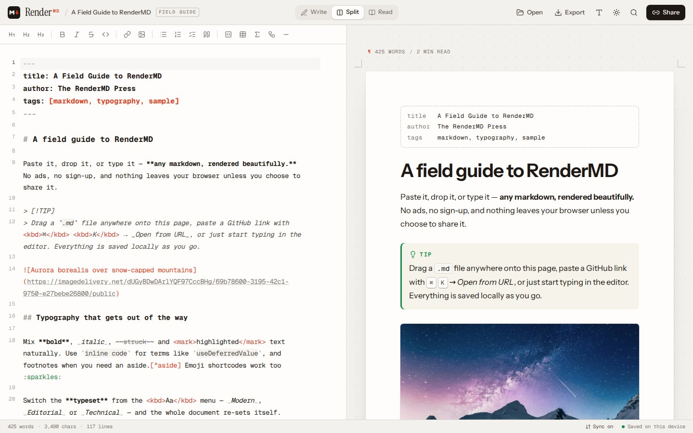
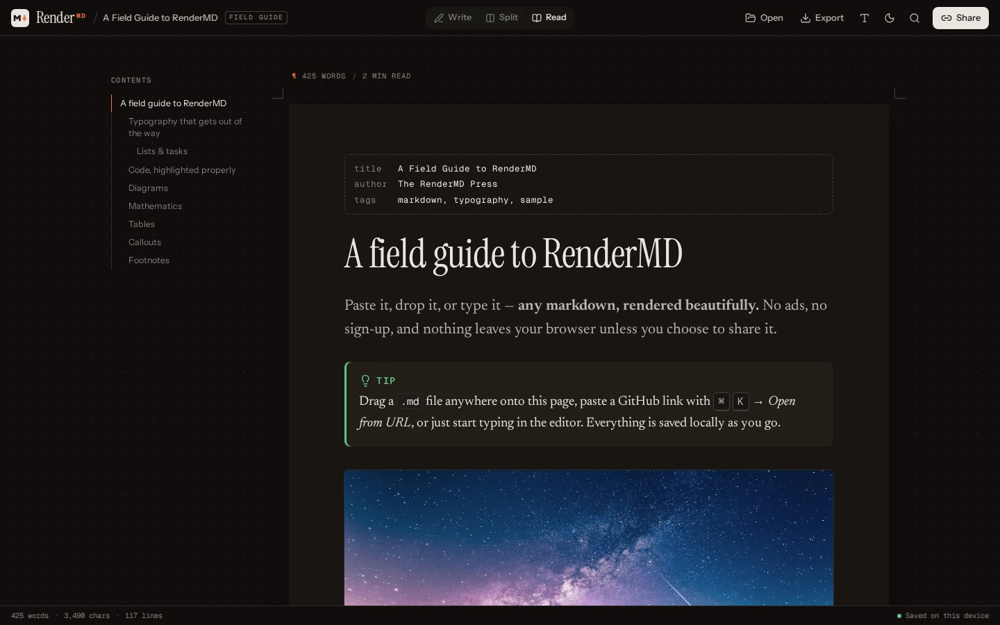
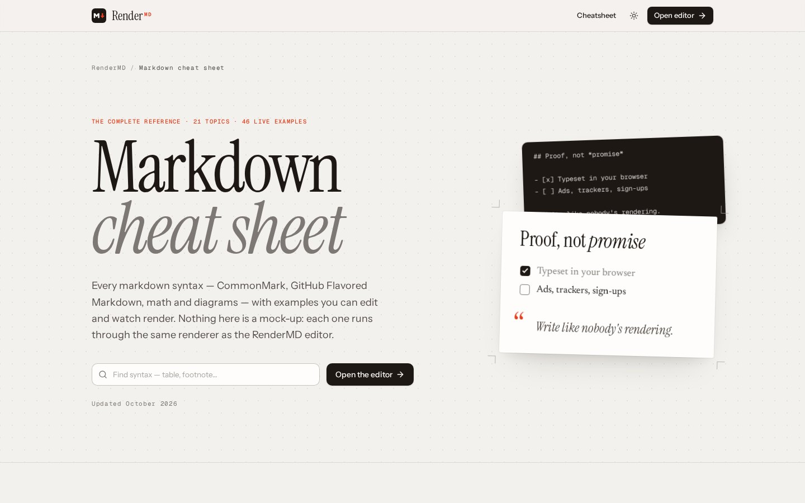

<div align="center">
  

# RenderMD

**Beautiful markdown, rendered instantly.**<br/>
Paste it, drop it, or link it — any markdown file, typeset in your browser. No ads, no sign-up, nothing uploaded.

[render-md.com](https://www.render-md.com) · [Cheatsheet](https://www.render-md.com/cheatsheet)

[](https://github.com/AdiRishi/render-md/actions/workflows/ci.yml) 

</div>



## Why

The web is full of "markdown preview" sites wrapped in ads and cookie banners. RenderMD is the opposite: a fast, private, genuinely beautiful place to read and write markdown.

- **Bring anything** — paste, drop a file anywhere on the page, open from disk, or load a URL. GitHub repos, files and gists are converted to raw automatically, and relative images keep working: `render-md.com/?url=github.com/owner/repo`.
- **Read it beautifully** — three typesets (_Modern_, _Editorial_, _Technical_), adjustable size and line length, an outline, reading progress, light and dark themes.
- **Everything renders** — GitHub Flavored Markdown, GitHub alerts, footnotes, emoji shortcodes, YAML frontmatter, safe raw HTML (`<details>`, `<kbd>`, centered images…), KaTeX math, every Mermaid diagram type (with an optional hand-drawn look), and syntax highlighting for 200+ languages.
- **Share privately** — a share link _is_ the document, compressed into the URL fragment, which browsers never send to a server.
- **Take it with you** — copy as formatted text (pastes cleanly into Docs, Gmail, Notion), save `.md` back to the file you opened, export a standalone `.html`, or print to PDF.
- **Write comfortably** — CodeMirror 6 with a formatting toolbar and shortcuts, line-accurate scroll sync, double-click the preview to jump to the source, tick task boxes right in the preview, a command palette (<kbd>⌘K</kbd>), and Undo for every document swap.
- **Installable** — as a PWA it can register as an "Open with…" handler for `.md` files.



The **[markdown cheat sheet](https://www.render-md.com/cheatsheet)** covers every syntax — CommonMark, GFM and beyond — with live examples you can edit in place, compatibility notes, a printable quick reference and an FAQ. Every example is rendered by the same engine as the editor.



## How it works

Markdown is rendered off the main thread in a Web Worker by a [unified](https://unifiedjs.com) pipeline (remark → rehype, sanitized with GitHub's rules), then turned into React with `hast-util-to-jsx-runtime`. Code is highlighted lazily with [Shiki](https://shiki.style) (JS regex engine, per-language code splitting), math with [KaTeX](https://katex.org), diagrams with [Mermaid](https://mermaid.js.org). Documents live in `localStorage`; nothing about them ever reaches the server.

| Layer     | Technology                                                                            |
| --------- | ------------------------------------------------------------------------------------- |
| Framework | [TanStack Start](https://tanstack.com/start) · React 19 (Activity, React Compiler)    |
| Build     | Vite 8 (Rolldown) · Nitro → Cloudflare Workers                                        |
| Language  | TypeScript 7 (native compiler)                                                        |
| Quality   | Oxlint (type-aware) · Oxfmt · Vitest 5                                                |
| Styling   | Tailwind CSS 4 · shadcn/ui on Base UI · Instrument Serif/Sans, Newsreader, Geist Mono |
| Editor    | CodeMirror 6                                                                          |
| Rendering | unified / remark / rehype in a Web Worker · Shiki · KaTeX · Mermaid                   |

## Development

Requires Node 24 (see `.node-version`) and pnpm.

```bash
pnpm install
pnpm dev        # http://localhost:3000
```

| Command       | What it does                                               |
| ------------- | ---------------------------------------------------------- |
| `pnpm dev`    | Dev server on port 3000                                    |
| `pnpm build`  | Production build for Cloudflare Workers (`.output/`)       |
| `pnpm test`   | Unit tests (Vitest)                                        |
| `pnpm check`  | Format check, type-aware lint and typecheck — what CI runs |
| `pnpm fix`    | Format and auto-fix lint issues                            |
| `pnpm deploy` | Deploy the build with Wrangler                             |

See [AGENTS.md](AGENTS.md) for an architecture tour and the design system.

## Deployment

`pnpm build` produces a Cloudflare module worker via Nitro (`nitro.config.ts`). CI deploys `main` automatically and uploads a preview version for every pull request. To target another host, change the Nitro preset.

## License

MIT — see [LICENSE](LICENSE).
