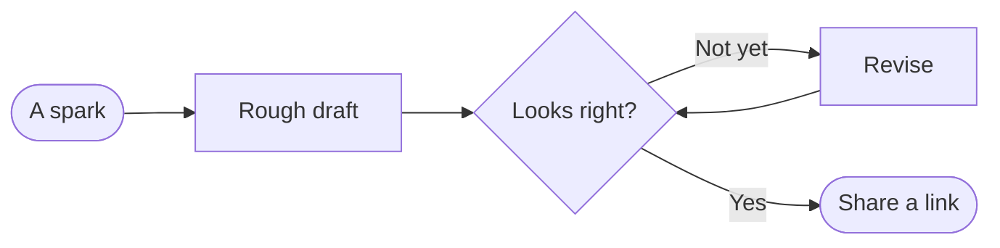

# A field guide to RenderMD

Paste it, drop it, or type it — **any markdown, rendered beautifully.** No ads, no sign-up, and nothing leaves your browser unless you choose to share it.

> [!TIP]
> Drag a `.md` file anywhere onto this page, paste a GitHub link with <kbd>⌘</kbd> <kbd>K</kbd> → _Open from URL_, or just start typing in the editor. Everything is saved locally as you go.


## Typography that gets out of the way

Mix **bold**, _italic_, ~~struck~~ and <mark>highlighted</mark> text naturally. Use `inline code` for terms like `useDeferredValue`, and footnotes when you need an aside.[^aside] Emoji shortcodes work too :sparkles:

Switch the **typeset** from the <kbd>Aa</kbd> menu — _Modern_, _Editorial_ or _Technical_ — and the whole document re-sets itself.

> The universe is made of stories, not of atoms.
>
> — Muriel Rukeyser

### Lists & tasks

1. Start with curiosity
2. Add persistence
   - and a little stubbornness
   - and a lot of coffee
3. Ship it

Tick a box in the preview and the markdown updates itself:

- [x] Render GitHub Flavored Markdown
- [x] Render math, diagrams and 200+ languages
- [ ] Change the world
- [ ] Take a nap

## Code, highlighted properly

```ts title="render.worker.ts"
// Parsing happens off the main thread, so typing never stutters.
self.onmessage = ({ data }: MessageEvent<RenderRequest>) => {
  const result = renderMarkdown(data.markdown, { stripPositions: true })
  self.postMessage({ id: data.id, ok: true, result })
}
```

```diff
- const html = await renderOnTheServer(markdown, { ads: true })
+ const html = renderInYourBrowser(markdown)
```

```sql
SELECT dreams.name, COUNT(*) AS frequency
FROM consciousness.dreams
WHERE dreamer = 'you' AND lucid = TRUE
GROUP BY dreams.name
ORDER BY frequency DESC
LIMIT 5;
```

## Diagrams

Any [Mermaid](https://mermaid.js.org) diagram renders inline. Try the _Sketch_ look in the <kbd>Aa</kbd> menu for a hand-drawn feel.



## Mathematics

Inline math sits in the line: $E = mc^2$, and $\nabla \times \mathbf{E} = -\frac{\partial \mathbf{B}}{\partial t}$.

Display math gets room to breathe:

$$
\int_{-\infty}^{\infty} e^{-x^2}\,dx = \sqrt{\pi}
$$

## Tables

| Shortcut                  |     Action      | Magic |
| :------------------------ | :-------------: | ----: |
| <kbd>⌘</kbd> <kbd>K</kbd> | Command palette |   ★★★ |
| <kbd>⌘</kbd> <kbd>O</kbd> |   Open a file   |   ★★☆ |
| <kbd>⌘</kbd> <kbd>S</kbd> |  Save to disk   |   ★★☆ |
| <kbd>⌘</kbd> <kbd>B</kbd> |    **Bold**     |   ★☆☆ |

## Callouts

> [!NOTE]
> GitHub-style alerts render as proper callouts.

> [!WARNING]
> Share links contain the whole document, compressed into the URL fragment — which is never sent to any server.

<details>
<summary>Raw HTML works too (safely sanitized)</summary>

READMEs love `<details>`, `<kbd>`, centered images and badges. RenderMD keeps the useful parts of HTML and strips anything that could run code.

</details>

---

_Clear this page and make it yours._

[^aside]: Footnotes collect at the end of the document, like they should.
